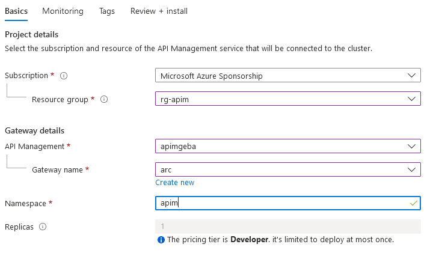
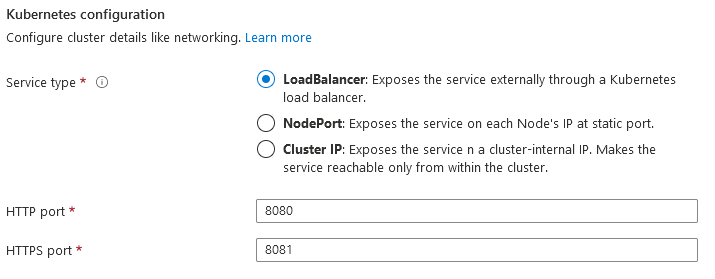
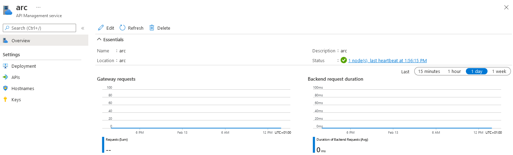

# APIM

## Deploy the extension with Azure CLI

If you want to deploy via the portal, skip to the next section.

⚠️ In contrast with App Services, you do not need a custom location to deploy the self-hosted gateway. This is because the gateway can be deployed on any cluster, regardless of being Azure Arc-enabled

First, you need to specify a APIM gateway.  This can be done via the 'gateways' blade in APIM in the Azure Portal.

Deploy the extension with the command below. This immediately deploys the self-hosted gateway.

```
endpoint="<Configuration URL of the Gateway>"
key="<token of the gateway>"
clu="AZURE ARC CLUSTER NAME"
rg="AZURE ARC RESOURCE GROUP NAME"

az k8s-extension create --cluster-type connectedClusters --cluster-name $clu \
  --resource-group $rg --name apim  --extension-type Microsoft.ApiManagement.Gateway \
  --scope namespace --target-namespace apim \
  --configuration-settings gateway.endpoint=$endpoint \
  --configuration-protected-settings gateway.authKey=$key \
  --configuration-settings service.type='LoadBalancer' --release-train preview
```

## Deployment via portal

In the Kubernetes Azure Arc resource, navigate to extensions and add the API Management extension. The extension will not ask you to run a script. The extension will be deployed directly.

⚠️ In the wizard, select the resource group that contains your APIM instance! You can then select the API Management instance and gateway or create a new gateway.

In the deployment via CLI, we did not configure metrics. The portal will ask for this and deploy the gateway with monitoring enabled to a chosen Log Analytics workspace.




For networking, choose LoadBalancer. This extension supports multiple service types. That is not the case for all extensions. For example, Event Grid for Kubernetes does not support LoadBalancer.




In Monitoring, you can optionally enable metrics.

Log Analytics settings:
- monitoring.customResourceId: resource ID of API Management instance (management plane)
- monitoring.workspaceId: Id of Log Analytics workspace
- monitoring.ingestionKey: ingestion key of Log Analytics workspace

Continue the wizard to create the extension. There are no scripts to run. The extension gets created and Azure Arc on your cluster will pick that up and install the self-hosted gateway.

⚠️ Remember, an extension is just an ARM resource. In this case of type microsoft.kubernetes/connectedclusters/microsoft.kubernetesconfiguration/extensions. In Azure Resource Graph Explorer, use the following query to find extensions: 

```
kubernetesconfigurationresources
| where type == "microsoft.kubernetesconfiguration/extensions"
```

⚠️ Check API Management and go to the Overview tab of the gateway. One node should be connected with heartbeats:



## Testing the gateway

Deploy a **toy API** with the commands below. This requires a working kube config for kubectl.

```
kubectl create deployment super --image ghcr.io/gbaeke/super:latest
kubectl expose deployment super --port 80 --target-port 8080 --type=ClusterIP
```

Now create an API in API Management. We assume you know how to create it.
- give the API a unique name
- the web service URL is: http://super.default (we assume that the super service above was created in the default namespace; if not, replace default with the name of the namespace you used)
- add a custom header (inbound processing)
- ensure the API is associated with the self-hosted gateway

Next, connect to the self-hosted gatewway with curl:

```
curl http://IP:5000/API/source

...
HTTP header: YOURCUSTOMHEADER=[value]
...
```

Above, replace IP with the public IP address use by the LoadBalancer service created by the extension.

⚠️ The IP address is the external IP of the LoadBalancer service created by the extension. The service will have a name in the form of `apim-gateway-APIMINSTANCE-GATEWAYNAME-apim-azure-api-management-gateway`

Replace API with the name of the API you created in Azure API Management.

Using the /source endpoint on the toy API, prints all headers. The custom header you created earlier should be shown.

Proceed to the `traefik` section to install Traefik on your cluster and access the API via Traefik as an Ingress Controller. You will then be able to access the API like below:

```
curl http://api.YOURINGRESSIP.nip.io/super/source
```

Go to [that section](traefik/README.md) to learn how to install Traefik on your cluster and then test the API.
